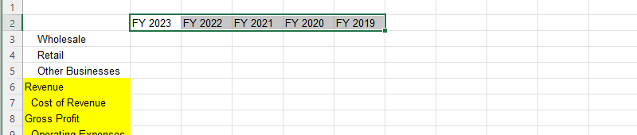

# Analysis and visualization of P&L data in excel

## Preview of Data  
   This data is a detailed Bloomberg extraction, outlining financial information over multiple fiscal years from 2016 to 2023. It provides an in-depth view of revenues, segmented by product, brand and geographic area,along with a breakdown of operating expenses,gross profits,net income and earnings per share(EPS). Specific figures for wholesale,retail,and other businesses are detailed across various regions,offering a comprehensive insight into the financial performance of the ticker “ADS GY Equity.  

# procedure in analyzing the data  

- ### Creation of P&L structure  
   Before preparing a concise P&L structure for the last five years,the source data and structure was examine and the following was observed at the outset of the data; company thicker,full company name,periodicity of financial statements,currency and measuring unit  

The Bloomberg spreadsheet has many details,but I focused on the following steps  

- identifying mnemonics that signal major P&L items,making the end of breakdown  
- Selecting the table and filtering non-blank cells in column B to hide deeper breakdowns  

#### This approach helps isolate essential information and streamlining the process of creating the P&L structure  
  

By filtering ,I obtained a structured that allows me to easily mark in yellow the figures I want to see in the report such as: Revenue ,Cost of Revenue,Gross profit,Operating Expenses and Operating income (equal to EBIT)  

  
 

To address the leading space issue a new column inside the report sheet that will be hidden was inserted,then I proceeded to removing the leading spaces to improve the formatting of the P&L table.  

  

As indicated in the task instructions,I changed the name  ‘operating income to EBIT. The P&L sheet was formatted properly by adding  an empty column for breathing space,by adding a clear indication of totals and subtotals and highlighting the header better and indicating the measurement units in the P&L header  

Populating of the new sheet,lookup source data, caculation of margings and growth rates
After formatting the P&L correctly,data was transferred from the source sheet into the new table. To ensure precision a nested lookup function was utilize considering two criteria; financial items on the left and the period under analysis in the table’s .  

**INDEX, MATCH,MATCH combination excel function was use to populate the Report shee**  

  

After transferring the numbers using lookup functions I added a check row at the bottom of my table, this allow me to determine whether I have made any mistakes,after which I compared these figures with those in my report .if the difference is zero,it confirms that I have worked correctly  

  

But it was not zero so I returned to the source sheet and observed i overlooked one of the items with a mnemonic code  

  

After including the row in the P&L statement and the check shows that the work is correct ,I added a few rows to make it easier to understand the firm’s Growth Profit and EBIT margins and their five-year revenue growth rate. CAGR was used as the measure for revenue growth.  
  

The CAGR was calculated using the following formula;  

  

  

# Visualization of the data  
  To illustrate how different business lines contributed to revenue,I created a stacked column chart,I selected the revenue breakdown figures and chose the following type of visualization from the insert tab  

  

# Interpreting the Data  

- Growth Analysis

The company exhibited steady revenue growth, with a CAGR(annual growth rate) of 7.33% from FY 2019 to FY 2023. This consistent growth is indicative of a solid and expanding business. The Retail segment stood out as the fastest-growing sector, with a CAGR of 14.49%, while the Wholesale segment saw the slowest growth, with a CAGR of 4.82%. The Other Businesses segment also showed commendable growth with a CAGR of 9.66%.

- Profitability Analysis

The company's profitability has improved remarkably over the period. The gross profit grew at a CAGR of 9.66%, and the gross profit margin increased from 46% to 50%. This uptick in margin demonstrates that the company has effectively managed its direct costs and possibly increased sales prices.

Furthermore, EBIT grew at a remarkable CAGR of 22.79%, with the EBIT percentage rising from 5% to 9%. This growth signifies better control over operating costs and an enhancement in operational efficiency.

## Summary

The financial data from FY 2019 to FY 2023 reflects a robust performance for the company in growth and profitability. Revenue growth has been steady, with strength in the Retail segment. Profitability has not only been maintained but has also seen significant improvements across key metrics, including substantial growth in EBIT. This balance of top-line growth with bottom-line improvements indicates a well-managed expansion. Adidas demonstrated a robust competitive position in the industry and a sustainable growth trajectory. The combination of growth in both revenue and profitability metrics suggests strategic execution in market penetration and cost control.

